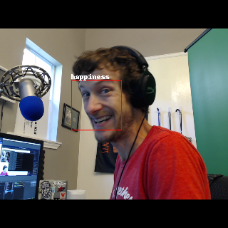

# May 13, 2019 Stream

- Time: 12-3 pm Central
- VOD [https://www.twitch.tv/videos/424359576](https://www.twitch.tv/videos/424359576)

## What we did

Photos with the Coral and Azure ML Emotion Tracking!

### Show and Tell (15 minutes)

- [X] Adafruit buttons and switches!
- [X] [My thoughts on ioT @ Build](https://dev.to/bsatrom/three-things-i-learned-about-microsoft-s-iot-vision-at-build-e5h)
- [X] Streaming schedule change!

### Edge ML & IoT Project

- [X] NEW Project: Emotion Mesh! Using the Google Coral and Particle Mesh to do Edge-based face-tracking and emotion detection
- [X] Walk through the Coral Object Detection and face-tracking source code
- [X] Figure out how to capture an image from the webcam
- [ ] UART Setup between Coral and Argon
- [ ] Set-up a project in Azure IoT Central for Emotion Mesh

## What we learned / Ideas for next time

- [ ] [jq](https://stedolan.github.io/jq/tutorial/) is an amazing tool for command-line JSON visualization and parsing
- [ ] Python built-in docs are your friend: https://www.programiz.com/python-programming/methods/built-in/sorted

## Thanks!

- [ ] @theMichaelJolley gifted a sub to @cpayette
- [ ] @clarkio gifted a sub to @Adam13531
- [ ] @groguard re-subbed for the 4th month!
- [ ] @jam3sn_ re-subbed for the 2nd month!
- [ ] Thanks @jam3sn_ (50), @roberttables (144), @theMichaelJolley (43), @cpayette (284) for the bits
- [ ] Thanks @cmgriffing for thwe raid with 20 viewers!
- [ ] Thanks @Adam13531 for the raid with 143 viewers!